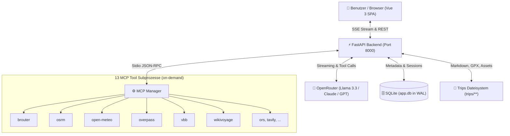

# Trip Planner App

AI-powered travel planning app: FastAPI backend + Vue 3 frontend for tour planning, session persistence, and itinerary browsing.

## Features

- AI chat flow for tour planning via SSE streaming
- Dynamic LLM-based session title summarization (condenses chat history into 3–5 key words after each prompt)
- Command Palette (`Cmd/Ctrl + K`) for instant search across saved tours, sessions, and quick theme toggle
- Glassmorphic streaming activity indicator with pulse-glow live status
- Toast notifications & one-click copy-to-clipboard for tour plans and GPX tracks
- Monokai Light & Dark themes with warm pergament light mode and high-contrast dark mode
- Rich multimedia rendering (public POI photos with figure captions, responsive 16:9 YouTube/Vimeo video embeds)
- Interactive Leaflet map with synchronized elevation profile hover highlight and GPX/GeoJSON route visualization
- Tour library and detail views for bike and road trips
- Structured tour metric badges with Lucide icons (distance, elevation gain, duration, difficulty, route type)
- Modern Lucide icon system across chat controls, query history, and exports
- Query history with selective deletion
- Atomic save and soft-delete/restore workflow
- Session persistence across browser restarts (stored session ID, last-viewed tour)
- Tour metadata in SQLite; markdown and GPX content on the filesystem

## Prerequisites

- Python 3.14+ with [uv](https://docs.astral.sh/uv/getting-started/installation/)
- Node.js 20+ with npm
- [just](https://github.com/casey/just) 1.20+ (command runner with module support)
- OpenRouter API key from [openrouter.ai](https://openrouter.ai/keys)
- ORS API key from [openrouteservice.org](https://openrouteservice.org/dev/#/signup) (geocoding/routing)

## Setup

```bash
# Backend
cd app/backend && uv sync

# Frontend
cd app/frontend && npm install
```

## Environment Variables

API keys load from two locations, in priority order:

1. `~/.env` — personal credentials, not committed
2. `project/.env` — project-specific overrides

### Variables

| Variable             | Used by   | Required | Description                              |
| -------------------- | --------- | -------- | ---------------------------------------- |
| `OPENROUTER_API_KEY` | Backend   | Yes      | OpenRouter API key for LLM orchestration |
| `LLM_MODEL`          | Backend   | No       | Override default model ID                |
| `ORS_API_KEY`        | MCP (ORS) | No       | OpenRouteService geocoding and routing   |
| `TAVILY_API_KEY`     | MCP       | No       | Web search support (hotels, attractions) |
| `SERPAPI_API_KEY`    | MCP       | No       | Flight search support (Google Flights)   |

## Development & Testing

From project root:

```bash
just dev            # Start backend (8000) and frontend (5173) concurrently
just backend dev    # Start only FastAPI backend with auto-reload
just frontend dev   # Start only Vite frontend with HMR
just check          # Run full CI suite (types, linter, all tests)
just test           # Run pytest and vitest test suites
just coverage       # Run backend pytest with coverage report
just audit          # Run security audit on frontend dependencies
just audit-fix      # Automatically fix security vulnerabilities
just format         # Auto-format Python (Ruff) and TypeScript/Vue (Prettier)
```

## Production

```bash
# Frontend build
cd app/frontend && npm run build

# Backend production start
cd app/backend && uv run python -m uvicorn main:app --host 0.0.0.0 --port 8000
```

## App Structure

```text
app/
├── backend/
│   ├── main.py                # FastAPI app and startup/shutdown lifecycle
│   ├── i18n.py                # UI translations
│   ├── app/routes/
│   │   ├── chat.py            # POST /api/chat with SSE streaming
│   │   ├── sessions.py        # Session management + last viewed tour persistence
│   │   ├── tours.py           # Tour CRUD + GPX endpoints
│   │   ├── trash.py           # Soft delete/restore workflow
│   │   └── health.py          # Health check
│   ├── core/
│   │   ├── agent.py           # LLM agent orchestration
│   │   ├── title_generator.py # LLM session title summarizer (3-5 key words)
│   │   ├── mcp_manager.py     # MCP server lifecycle and tool routing
│   │   ├── model_gateway.py   # OpenRouter configuration
│   │   └── context.py         # Tour context and prompt assembly
│   ├── storage/
│   │   ├── db.py              # SQLite session/tour metadata
│   │   └── tour_storage.py    # Filesystem tour storage and DB sync
│   └── pyproject.toml
├── frontend/
│   ├── src/
│   │   ├── App.vue            # Main app shell and session restore logic
│   │   ├── api.ts             # API client helpers
│   │   ├── i18n.ts            # de/en translations
│   │   ├── composables/
│   │   │   └── useChat.ts     # Chat state and loading logic
│   │   └── components/
│   │       ├── ChatInput.vue
│   │       ├── TourContent.vue
│   │       ├── TourLibrary.vue
│   │       └── TourMap.vue
│   ├── package.json
│   ├── vite.config.ts
│   └── tailwind.config.js
└── README.md
```

## API overview

| Method | Path                               | Description                                 |
| ------ | ---------------------------------- | ------------------------------------------- |
| POST   | `/api/chat`                        | Send prompt and receive SSE stream          |
| GET    | `/api/sessions`                    | List sessions                               |
| GET    | `/api/sessions/{id}`               | Get session details                         |
| GET    | `/api/sessions/{id}/last-viewed`   | Load last viewed tour for a session         |
| PUT    | `/api/sessions/{id}/last-viewed`   | Save last viewed tour for a session         |
| GET    | `/api/tours`                       | List saved tours with metadata              |
| POST   | `/api/tours`                       | Save new tour (markdown & GPX) to disk & DB |
| GET    | `/api/tours/{type}/{slug}`         | Fetch tour detail with metrics & markdown   |
| GET    | `/api/tours/{type}/{slug}/gpx`     | Download GPX route                          |
| GET    | `/api/tours/{type}/{slug}/geojson` | Export route as GeoJSON                     |
| DELETE | `/api/tours/{type}/{slug}`         | Move tour to trash                          |
| GET    | `/api/trash`                       | List trashed tours                          |
| GET    | `/api/health`                      | Health check                                |

## Architecture



### Key Architectural Concepts

- **Single Source of Truth (`context/`):** Context files dynamically load by detected tour type (`bike`, `road`, `general`) from `context/travel/` alongside `skills/` instructions and the current system date.
- **Dual-Layer Storage:** SQLite (`aiosqlite` with WAL mode) indexes sessions, messages, and tour metadata, while the filesystem (`trips/**`) maintains human-readable markdown and transportable GPX files.
- **Isolated MCP Subprocess Model:** 13 specialized FastMCP tool servers start on demand via `stdio` and are managed with crash recovery, timeouts, and JSON-RPC message routing.
- **Streaming & Cancellation:** Real-time Server-Sent Events (SSE) stream model progress, tool invocations, route coordinates, and markdown output with client-side `AbortController` cancellation.
- **Triple-Layer Content Security:** Safe rendering through regex placeholder filtering, custom URL validation in `marked`, and `DOMPurify` HTML sanitization.

## Key dependencies

### Backend

- FastAPI
- pydantic-ai
- aiosqlite
- uvicorn

### Frontend

- Vue 3
- Vite
- Tailwind CSS
- Leaflet (Interactive mapping)
- Lucide Vue (`@lucide/vue` modern icon system)
- Marked & DOMPurify (Safe markdown rendering)
