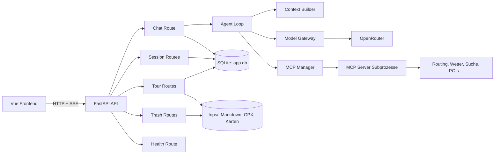
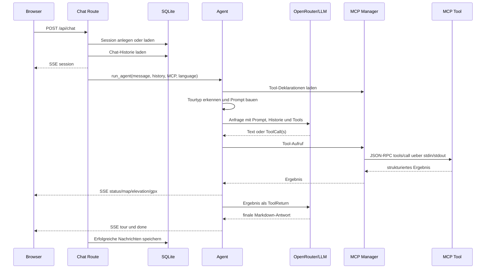

# Architekturuebersicht: App-Backend

Dieses Dokument beschreibt das Backend der Trip-Planner-App unter `app/backend`.
Das Backend ist eine asynchrone FastAPI-Anwendung. Es stellt eine HTTP-API fuer
Chat, Sitzungen und gespeicherte Touren bereit und orchestriert ein LLM mit
externen Reiseplanungswerkzeugen ueber MCP (Model Context Protocol).

## Lesart dieser Architektur

Das Backend besteht aus vier fachlichen Ebenen:

1. **API-Ebene:** FastAPI-Router validieren Anfragen, verwalten Sessions und
   streamen Chat-Ergebnisse.
2. **Orchestrierung:** Der Agent entscheidet iterativ, ob das LLM direkt
   antwortet oder ein externes Werkzeug benoetigt.
3. **Integrationen:** Der MCP-Manager kapselt die Kommunikation mit den
   unabhaengigen Routing-, Wetter-, Such- und Inhaltsservern.
4. **Persistenz:** SQLite speichert Metadaten und Chatverlauf; Tourinhalte
   bleiben als Markdown, GPX und Karten im Repository-Dateisystem.

Die Abhaengigkeitsrichtung verlaeuft dabei grundsaetzlich von HTTP ueber die
Orchestrierung zu Integrationen und Persistenz. Die Router enthalten keine
LLM- oder MCP-Protokolllogik; diese liegt in `core/`.

## 1. Gesamtbild



## 2. Komponenten und Verantwortlichkeiten

| Bereich                   | Verantwortlichkeit                                                  |
| ------------------------- | ------------------------------------------------------------------- |
| `main.py`                 | Anwendung erzeugen, Startup/Shutdown und Router registrieren        |
| `app/routes/`             | HTTP-Vertraege und Request-/Response-Verarbeitung                   |
| `core/agent.py`           | LLM-Agentenschleife, Tool-Aufrufe und SSE-Ereignisse                |
| `core/context.py`         | Tourtyp erkennen und Systemprompt aus Kontextdateien bauen          |
| `core/model_gateway.py`   | OpenRouter konfigurieren und pydantic-ai-Modell liefern             |
| `core/mcp_manager.py`     | MCP-Server starten, Tools entdecken und Aufrufe routen              |
| `storage/db.py`           | SQLite-Metadaten fuer Sessions, Nachrichten und Touren              |
| `storage/tour_storage.py` | Markdown/GPX/Karten im Dateisystem und SQLite-Index synchronisieren |

Der Einstiegspunkt ist `app/backend/main.py`. Die FastAPI-`lifespan`-Funktion
initialisiert beim Start SQLite, synchronisiert vorhandene Touren aus `trips/`
und entdeckt die Tools der konfigurierten MCP-Server. Fuer die Discovery werden
die 13 Server parallel gestartet; danach haelt der Manager die Instanzen offen
und verwendet sie fuer Chat-Anfragen wieder. Beim Shutdown werden die Prozesse
beendet. Konfiguriert sind unter anderem
BRouter, OSRM, OpenRouteService, Open-Meteo, Overpass, VBB, Wikivoyage,
Tavily und SerpAPI Flights.

Die wichtigste lokale Struktur ist:

```text
app/backend/
├── main.py                 # FastAPI-App und Lebenszyklus
├── app/routes/             # HTTP-API
├── core/
│   ├── agent.py            # LLM-Schleife und SSE-Ereignisse
│   ├── context.py          # Tourtyp und Prompt-Kontext
│   ├── model_gateway.py    # OpenRouter/pydantic-ai
│   └── mcp_manager.py      # MCP-Prozesse und Tool-Routing
└── storage/
  ├── db.py               # SQLite-Zugriff ohne ORM
  └── tour_storage.py     # Dateisystem plus SQLite-Index
```

## 3. Chat-Datenfluss



Der zentrale Request ist `POST /api/chat` in `app/routes/chat.py`:

1. Ohne `session_id` wird eine UUID erzeugt.
2. Eine unbekannte Session wird angelegt; der Text wird als `bike`, `road` oder
   `general` klassifiziert.
3. Die Chat-Historie wird aus SQLite gelesen. Der Agent verwendet maximal sechs
   Nachrichten aus der Historie.
4. `run_agent()` bezieht das Modell, laedt MCP-Deklarationen und baut den Prompt.
5. Das Modell liefert entweder Text oder einen oder mehrere Tool Calls.
6. Tool Calls werden ausgefuehrt; Geo-Ergebnisse werden als Frontend-Ereignisse
   aufbereitet und als Tool-Ergebnis an das Modell zurueckgegeben.
7. Sobald kein weiterer Tool Call noetig ist, wird die Markdown-Antwort als
   `tour` und danach `done` gesendet.
8. User- und Assistant-Nachricht werden nur bei erfolgreichem Abschluss in
   SQLite gespeichert. Ein Fehler im Stream verhindert damit einen unvollstaendigen
   Chatverlauf.

## 4. Kontext, Modell und Agentenschleife

`core/context.py` baut den Systemprompt dynamisch aus Repository-Dateien:

- Allgemeine Reisevorlieben werden immer aus `context/travel/user-preferences.md`
  geladen.
- Bei Radtouren kommen Radpraeferenzen, `skills/bike-planner/SKILL.md` und das
  Ausgabe-Template hinzu.
- Bei Roadtrips werden die entsprechenden Roadtrip-Dateien geladen.
- Bei allgemeinem Text wird nur der universelle Kontext verwendet.

Pro Kontextdatei werden maximal 1800 Zeichen verwendet. Der Prompt enthaelt
zusaetzlich die nach Tourtyp gefilterten Toolnamen.

`core/model_gateway.py` konfiguriert pydantic-ai fuer OpenRouter. Die App setzt
OpenRouter als OpenAI-kompatiblen Endpoint; standardmaessig wird
`meta-llama/llama-3.3-70b-instruct` verwendet, sofern `LLM_MODEL` nicht gesetzt
ist.

### Rolle von pydantic-ai

`pydantic-ai` bildet die technische Modellschicht zwischen dem eigenen Agenten
und dem LLM. Es stellt eine einheitliche Schnittstelle fuer Modellanfragen,
Nachrichten und Tool-Definitionen bereit. In `core/agent.py` werden unter
anderem `ModelRequest`, `ModelResponse`, `TextPart`, `ToolCallPart` und
`ToolReturnPart` verwendet. Die aus MCP gewonnenen Tool-Schemas werden in
`ToolDefinition`-Objekte umgewandelt und gemeinsam mit der Anfrage an das
Modell uebergeben.

Die Anwendung verwendet dabei bewusst nicht die vollstaendige High-Level-
Agentensteuerung von pydantic-ai. Die agentische Orchestrierung bleibt eigener
Code in `run_agent()`: Er erkennt Tool Calls, ruft den `MCPManager` auf,
verarbeitet Geo-Ergebnisse, streamt SSE-Ereignisse und entscheidet anhand der
Modellantwort, ob eine weitere Iteration erforderlich ist. `pydantic-ai`
liefert also Modell- und Nachrichtenabstraktionen, nicht den Reiseplanungs-
Workflow selbst.

`core/agent.py` steuert die Modellaufrufe manuell. Pro Anfrage gibt es maximal
25 Iterationen. Leere Antworten koennen zweimal durch eine Folgeanweisung
repariert werden. Der Kontext wird bei Bedarf verkleinert, indem alte grosse
Tool-Ergebnisse durch einen Platzhalter ersetzt werden. Einzelne Tool-Ergebnisse
werden auf 4000 Zeichen und die finale Antwort auf 1536 Tokens begrenzt.

## 5. SSE-Ereignisse

Die Chat-Route liefert eine `EventSourceResponse` mit diesen Ereignissen:

| Ereignis    | Zweck                                         |
| ----------- | --------------------------------------------- |
| `session`   | Session-ID an den Browser uebergeben          |
| `status`    | Fortschritt nach Tool-Kategorie melden        |
| `map`       | Route, Wegpunkte oder POI-Marker fuer Leaflet |
| `elevation` | Hoehenprofil aus GPX-Trackpunkten             |
| `gpx`       | GPX-Inhalt fuer den Download                  |
| `tour`      | Finale Markdown-Tour                          |
| `error`     | Lokalisierte Fehlermeldung                    |
| `done`      | Abschluss inklusive Iterationsanzahl          |

Routen-Geometrien und GPX-Daten werden nach der Frontend-Aufbereitung aus dem
Tool-Ergebnis entfernt, damit der naechste LLM-Request kleiner bleibt.

## 6. MCP-Integration

`MCPManager` ist ein eigener MCP-Client:

- Jeder Server wird als eigener Prozess mit `uv run ... server.py` gestartet.
- Die Kommunikation nutzt newline-delimited JSON-RPC ueber stdin/stdout.
- Der Handshake besteht aus `initialize`, der Initialized-Notification und
  `tools/list`.
- Toolnamen erhalten ein eindeutiges Praefix, zum Beispiel
  `mcp_brouter_calculate_route`. Eine Map ordnet den Namen dem Server und dem
  Originalnamen zu.
- `call_tool()` sendet `tools/call`, extrahiert Textinhalte und dekodiert JSON,
  wenn moeglich.
- Netzwerk- oder Prozessfehler werden als strukturierte `error`-Ergebnisse
  zurueckgegeben. Ein MCP-Request hat ein Timeout von 60 Sekunden.

Die Tool-Deklarationen werden beim Startup entdeckt und danach wiederverwendet.
Die Server werden zwar bei der Discovery vorab gestartet, die Aufrufschicht
behandelt sie dennoch als lazy verwaltete Instanzen: `_ensure_server()` startet
einen fehlenden oder beendeten Prozess bei Bedarf neu. Pro Server serialisiert
ein Lock die JSON-RPC-Kommunikation.

## 7. Persistenz

### SQLite

`storage/db.py` verwendet `aiosqlite` ohne ORM. Die Datenbank
`app/backend/data/app.db` enthaelt:

- `sessions`: ID, Titel, Sprache, Tourtyp, Zeitstempel und zuletzt betrachtete
  Tour.
- `messages`: User-/Assistant-Nachrichten je Session.
- `tours`: Tour-Metadaten, Slug, Typ, Zusammenfassung und Session-Verknuepfung.

SQLite ist der schnelle Index fuer Listen und Beziehungen, nicht der Speicher
fuer den vollstaendigen Tourinhalt.

### Dateisystem

```text
trips/{bike|road}/{slug}/
├── index.md
├── gpx/route.gpx       (optional)
└── maps/               (optional)
```

`tour_storage.py` extrahiert Titel und Zusammenfassung aus Markdown, erzeugt
einen Slug und legt parallel den SQLite-Metadatensatz an. Die Tour-ID ist mit
UUID5 aus Tourtyp und Slug deterministisch.

Loeschen ist ein Soft Delete: Das Tourverzeichnis wird nach
`trips/.trash/{tour_type}/{slug}/` verschoben. Es kann von dort restauriert oder
endgueltig geloescht werden. Beim Lesen werden relative Kartenreferenzen im
Markdown auf die API-Route fuer Kartenbilder umgeschrieben. Mehrere GPX-Dateien
koennen zu einem GPX-Dokument mit mehreren Tracks kombiniert werden.

## 8. HTTP-API

| Methode      | Route                                         | Zweck                                               |
| ------------ | --------------------------------------------- | --------------------------------------------------- |
| `POST`       | `/api/chat`                                   | Chat starten/fortsetzen, SSE-Stream liefern         |
| `GET`        | `/api/sessions`                               | Sessions auflisten                                  |
| `GET`        | `/api/sessions/{id}`                          | Session mit Nachrichten laden                       |
| `GET`, `PUT` | `/api/sessions/{id}/last-viewed`              | Zuletzt betrachtete Tour lesen/speichern            |
| `GET`        | `/api/tours`                                  | Tour-Metadaten auflisten, optional nach Typ filtern |
| `POST`       | `/api/tours`                                  | Markdown/GPX als Tour speichern                     |
| `GET`        | `/api/tours/{type}/{slug}`                    | Tourdetails und Markdown laden                      |
| `GET`        | `/api/tours/{type}/{slug}/gpx`                | GPX herunterladen                                   |
| `GET`        | `/api/tours/{type}/{slug}/maps/{filename}`    | PNG-Karte ausliefern                                |
| `DELETE`     | `/api/tours/{type}/{slug}`                    | Tour in den Papierkorb verschieben                  |
| `GET`        | `/api/trash`                                  | Papierkorb auflisten                                |
| `POST`       | `/api/trash/{tour_type}/{trash_name}/restore` | Tour wiederherstellen                               |
| `DELETE`     | `/api/trash/{tour_type}/{trash_name}`         | Tour dauerhaft loeschen                             |
| `DELETE`     | `/api/trash`                                  | Papierkorb leeren                                   |
| `GET`        | `/api/health`                                 | Grundlegenden Provider-Status melden                |

## 9. Konfiguration und Betrieb

`.env`-Werte werden zuerst aus `~/.env` und danach aus der Projektdatei geladen;
Projektwerte ueberschreiben Home-Werte.

- `OPENROUTER_API_KEY` ist fuer das LLM erforderlich.
- `LLM_MODEL` ueberschreibt optional die Modell-ID.
- `ORS_API_KEY`, `TAVILY_API_KEY` und `SERPAPI_API_KEY` aktivieren jeweils
  bestimmte MCP-Integrationen.

In der Entwicklung laeuft FastAPI auf Port 8000 und Vite auf Port 5173; Vite
proxied `/api` zum Backend. In Produktion kann FastAPI das gebaute Frontend aus
`app/frontend/dist` ausliefern.

Fehler werden entweder als HTTP-Fehler der Verwaltungsrouten oder als
lokalisierte SSE-`error`-Ereignisse des Chats ausgegeben. Der Health-Endpunkt
prueft aktuell nur, ob `OPENROUTER_API_KEY` gesetzt ist; die Erreichbarkeit von
LLM und MCP-Servern wird dort nicht getestet.

## Kurzfassung

Das Backend verbindet eine duenne FastAPI-Schicht mit einer manuell
kontrollierten LLM-Agentenschleife. Der Agent waehlt passend zum Tourtyp
Kontext und MCP-Werkzeuge, ruft diese ueber isolierte Subprozesse auf und
streamt relevante Zwischenresultate per SSE. Session-Metadaten liegen in
SQLite; die eigentlichen, reproduzierbar versionierbaren Tourartefakte liegen
als Markdown, GPX und Karten unter `trips/`.
